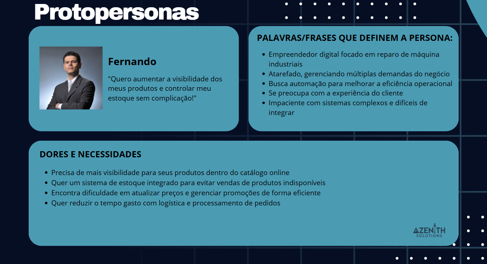

  
  # Azenith Solutions
  
  ## Hardware Tech | Inventory Management + Product Cataloging
  
  
  
  **Extension Project SPTech School**  
  São Paulo - SP / 2025

---

## Table of Contents
1. [Project Context](#project-context)
2. [Objective](#objective)
3. [Justification](#justification)
4. [Project Scope](#project-scope)
5. [Assumptions](#assumptions)
6. [Constraints](#constraints)
8. [Lean UX](#lean-ux)
9. [Proto-personas](#proto-personas)
10. [BPMN](#bpmn)
11. [Solution Diagram](#solution-diagram)
12. [Architecture Spreadsheet](#architecture-spreadsheet)
13. [C4 Model](#c4-model)
14. [ERD](#erd)
15. [Sustainable Development Goals](#sustainable-development-goals)
16. [References](#references)

---

## Project Context
The market for electronic components and repair for industrial equipment in Brazil is expanding, driven by the growing demand for maintenance and updating of industrial equipment.
> 

According to an article by Mordor Intelligence, the industrial electrical components market is projected to grow at a compound annual growth rate (CAGR) of over 4% in the next five years. The Brazilian facility maintenance sector is growing at an annual rate of 10%, estimated at R$ 10 billion [DOCUMENTAOOFICIALDOSISTEMA.pdf].

---

## Objective
The general objective of this project is to develop an integrated inventory management system and an industrial components catalog, enabling online product organization and better inventory management.

---

## Justification
This project aims to expand the company's market reach, attracting potential customers and opening possibilities for new services. With this, it is expected to:
- Reach a larger audience
- Increase sales
- Improve operational efficiency 
- Reduce manual errors in inventory management and registration

---

## Project Scope

- Development of a landing page for company promotion
- Creation of an inventory management system
- Development of a catalog integrated with the inventory

---

## Assumptions
- The company already has a CNPJ (National Registry of Legal Entities) and is legally established.
- The current inventory will be migrated to the new system.
- The team will have access to the necessary information.
- The project will be developed within one year.

  
---

## Constraints

- Full completion within a 1-year deadline.
- Budget limited to the resources of the college and the company.
- Use of open-source technologies to reduce costs.
- Time limitations of the developers, as they are students and they are doing intership.

---

## Lean UX

---

## Proto-personas  

---  

## BPMN

  
---

## Solution Diagram  

---  

## Architecture Spreadsheet  

---

## C4 Model  

---

## ERD Entity-Relationship Diagram

---

## Sustainable Development Goals
The SDGs are a global agenda adopted by the UN, consisting of 17 goals and 169 targets for 2030, aiming for sustainable development in economic, social, and environmental dimensions.
-  **Decent Work and Economic Growth:**
Promote inclusive economic growth, productive employment, and decent work.
This project contributes to business efficiency and expansion.
-  **Industry, Innovation and Infrastructure:**
Build resilient infrastructure, promote sustainable industrialization and innovation, using open-source technologies.

  
  

## References
- https://www.mordorintelligence.com/pt/industry-reports/industrial-electrical-components-market
- https://apc.com.br/manutencao/o-setor-manutencao-reparos-no-brasil

## Authors - Azenith Team
- [Diogo Polastrine](https://github.com/Polastrine)
- [Henrique Serikov](https://github.com/HenriqueSericov)
- [Jean Charles](https://github.com/jeancharlesexe)
- [João Victor](https://github.com/Joao-Victor-Barroso-Melo)
- [Kauan França](https://github.com/kauansfr)
- [Mariana Dias](https://github.com/marianalopesz)

---

Setup the entire project [here](https://github.com/Azenith-Solutions/documentation-START-HERE/blob/main/setup-manual.md)
